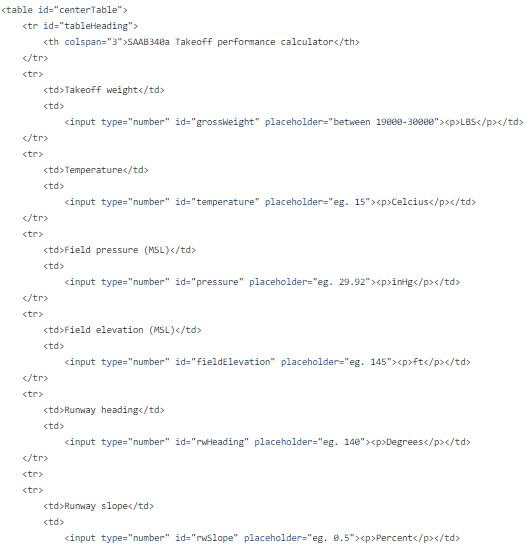
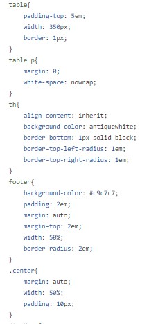
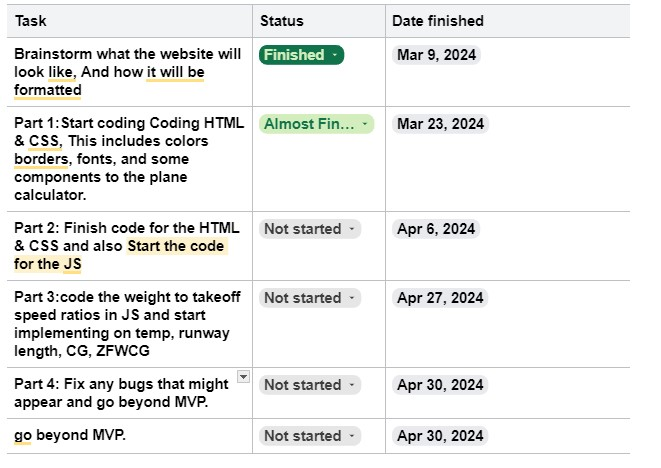

# Entry 4
##### 3/16/2024

### Intro/Context

During the time between finishing blog 3 and making blog 4, I have made significant progress towards my MVP, I have finished brainstorming on what my website will look like, I also have started in the HTML and CSS and to get ahead and finish early so that I can get ahead of myself and finish early so I can add to my MVP. I also have been learning my tool. and learned a lot of things about changing attributes and removing attributes, as well as removing and changing content inside an element.

### Learning my tool

Some of the things that I have learned that were mentioned previously were changing attributes and removing attributes, and removing and changing content inside an element. Let's start with how I'm learning these things. I am learning this from a YouTuber called [Net Ninja](https://www.youtube.com/@NetNinja). He has a series of short videos that explain and also demonstrate the basics of jQuery for beginners.

### `.Empty` and `.remove`

we can use `.empty` and `.remove`. `.empty` empty content what ever is inside it, For example:
`$(".button").empty()`. Whatever was in the element button it would be gone but the element would not be deleted. There is also another one called `.remove`. This takes the element and snaps it out of existence like what Thanos did, Example:
`$(".button").remove()`
This will delete the element and whatever is inside it.

### Changing Attributes

[Video on Attributes](https://www.youtube.com/watch?v=VYbRyVh803I&list=PL4cUxeGkcC9hNUJ0j6ccnOAcJIPoTRpO4&index=12)

In that video, it talks about removing an attribute and also changing an attribute. the video talks about two ways to change an attribute. One way is just removing it and another way is changing the name of the attribute. They are called `.removeattr` and the other one is `.attr`

### progress on MVP

So far I have completed the brainstorming part on how my website will look and have started on the HTML and CSS. I will not show much but this is just a hint/preview of the code. As you can see there are a lot of things here like gross weight, temperature, pressure, field elevation, rwheading(RunWay)rwheading, RWslope, windDegrees/wind direction, windSpeed,  flaps, etc. same thing with the CSS I will not show everything, just to keep you guys interested and waiting for the final product but I will continue to show little sneak peeks here and there.

## Skills
During this process, I developed the ability to pay **Attention to detail**. As you can see by the number of things that are going into this calculator we can see that a lot of things are going into this calculator and being able to pay Attention to detail is a must skill to have. Another skill I have learned is **Consideration** because I know that other people can use this product and it would be helpful for other people to use.

## EDP
Currently, we are now in the fourth process of the Engineering Design Process (EDP), which includes planning. Here we are planning and ongoing to make our prototype to test out and debug. I also have created a plan/timeline for what needs to be done for this product.

[Previous](entry03.md) | [Next](entry05.md)

[Home](../README.md)